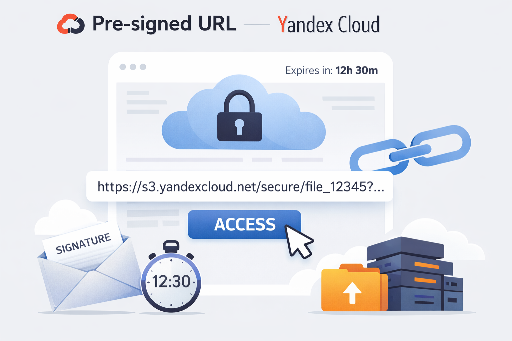

# Yandex-Cloud-S3-PRE-Signed-URL
Script for generating URLs for uploading files to Yandex Cloud S3

https://yandex.cloud/ru/docs/storage/concepts/pre-signed-urls



## Usage:

Create venv:

```sh
python3 -m venv venv
```

Use env:

```sh
source ./venv/bin/activate
```

Install dependencies:

```sh
pip3 install boto3
```

Or install from requirements.txt:

```sh
pip3 install --no-cache-dir -r requirements.txt
```

Generate PRE-signed-URL:

```sh
python3 pre-signed-url-generator.py
```


## Examples

**PRE-signed URL:**
```
{
    "url": "https://storage.yandexcloud.net/your-bucket-name",
    "fields": {
        "key": "file-name.txt",
        "x-amz-algorithm": "AWS4-HMAC-SHA256",
        "x-amz-credential": "your-access-key/20260113/ru-central1/s3/aws4_request",
        "x-amz-date": "20260113T082501Z",
        "policy": "eyJleHBpcmF0aW9uIjogIjIwMjYtMDEtMTNUMDk6MjU6MDFaIiwgImNvbmRpdGlvbnMiOiBbWyJjb250ZW50LWxlbmd0aC1yYW5nZSIsIDEsIDUyNDI4ODBdLCB7ImJ1Y2tldCI6ICJ5b3VyLWJ1Y2tldC1uYW1lIn0sIHsia2V5IjogImZpbGUtbmFtZS50eHQifSwgeyJ4LWFtei1hbGdvcml0aG0iOiAiQVdTNC1ITUFDLVNIQTI1NiJ9LCB7IngtYW16LWNyZWRlbnRpYWwiOiAieW91ci1hY2Nlc3Mta2V5LzIwMjYwMTEzL3J1LWNlbnRyYWwxL3MzL2F3czRfcmVxdWVzdCJ9LCB7IngtYW16LWRhdGUiOiAiMjAyNjAxMTNUMDgyNTAxWiJ9XX0=",
        "x-amz-signature": "generated-signature"
    }
}
```

**Request for upload file:**

```sh
curl \
--verbose \
--request POST \
--form "key=file-name.txt" \
--form "X-Amz-Algorithm=AWS4-HMAC-SHA256" \
--form "X-Amz-Credential=your-access-key/20260113/ru-central1/s3/aws4_request" \
--form "X-Amz-Date=20260113T082501Z" \
--form "policy=eyJleHBpcmF0aW9uIjogIjIwMjYtMDEtMTNUMDk6MjU6MDFaIiwgImNvbmRpdGlvbnMiOiBbWyJjb250ZW50LWxlbmd0aC1yYW5nZSIsIDEsIDUyNDI4ODBdLCB7ImJ1Y2tldCI6ICJ5b3VyLWJ1Y2tldC1uYW1lIn0sIHsia2V5IjogImZpbGUtbmFtZS50eHQifSwgeyJ4LWFtei1hbGdvcml0aG0iOiAiQVdTNC1ITUFDLVNIQTI1NiJ9LCB7IngtYW16LWNyZWRlbnRpYWwiOiAieW91ci1hY2Nlc3Mta2V5LzIwMjYwMTEzL3J1LWNlbnRyYWwxL3MzL2F3czRfcmVxdWVzdCJ9LCB7IngtYW16LWRhdGUiOiAiMjAyNjAxMTNUMDgyNTAxWiJ9XX0=" \
--form "X-Amz-Signature=generated-signature" \
--form "file=@sample.txt" \
https://YOUR_BUCKET_NAME.storage.yandexcloud.net
```

**Policy field**

Policy field is a base64 encoded params

```
{
  "expiration": "2026-01-13T09:25:01Z",
  "conditions": [
    [
      "content-length-range",
      1,
      5242880
    ],
    {
      "bucket": "your-bucket-name"
    },
    {
      "key": "file-name.txt"
    },
    {
      "x-amz-algorithm": "AWS4-HMAC-SHA256"
    },
    {
      "x-amz-credential": "your-access-key/20260113/ru-central1/s3/aws4_request"
    },
    {
      "x-amz-date": "20260113T082501Z"
    }
  ]
}
```

